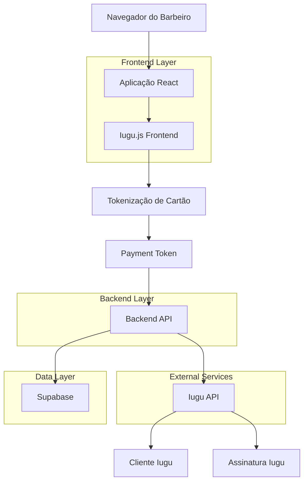
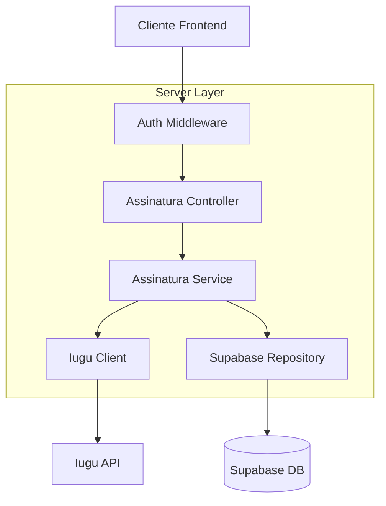
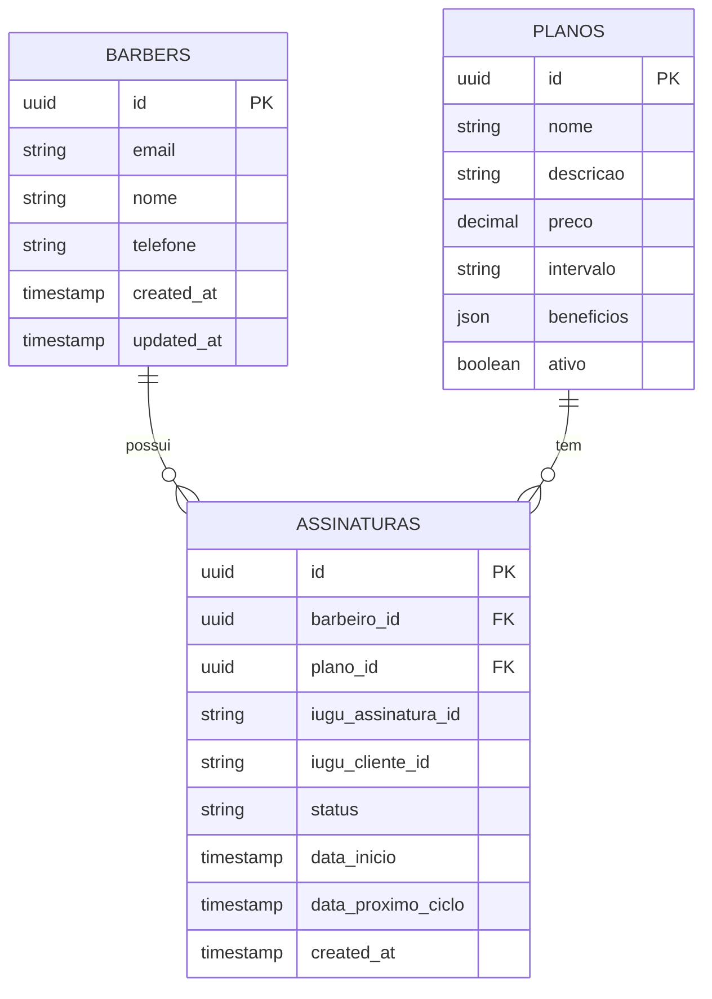

## 1. Arquitetura do Sistema



## 2. Tecnologias Utilizadas

- Frontend: React@18 + TypeScript + TailwindCSS@3
- Backend: Node.js + Express@4 + TypeScript
- Banco de Dados: Supabase (PostgreSQL)
- Gateway de Pagamento: Iugu
- Inicialização: vite-init

## 3. Definições de Rotas

| Rota | Propósito |
|-------|---------|
| /planos | Exibir planos disponíveis para assinatura |
| /checkout/:planoId | Página de checkout com formulário de pagamento |
| /checkout/sucesso | Página de confirmação de assinatura criada |
| /api/assinaturas/criar | Endpoint para criar assinatura no Iugu |
| /api/webhooks/iugu | Webhook para receber eventos do Iugu |

## 4. Definições de API

### 4.1 Criar Assinatura
```
POST /api/assinaturas/criar
```

Request:
| Parâmetro | Tipo | Obrigatório | Descrição |
|-----------|-------------|-------------|-------------|
| payment_token | string | true | Token do cartão gerado pelo Iugu.js |
| plano_id | string | true | ID do plano selecionado |
| barbeiro_id | string | true | ID do barbeiro no sistema |
| email | string | true | Email do barbeiro |
| nome | string | true | Nome completo do barbeiro |

Response:
| Parâmetro | Tipo | Descrição |
|-----------|-------------|-------------|
| success | boolean | Status da operação |
| assinatura_id | string | ID da assinatura no Iugu |
| mensagem | string | Mensagem de retorno |

Exemplo:
```json
{
  "payment_token": "tok_123456789",
  "plano_id": "plan_premium_001",
  "barbeiro_id": "usr_abc123",
  "email": "barbeiro@email.com",
  "nome": "João Silva"
}
```

### 4.2 Tipos TypeScript
```typescript
interface CriarAssinaturaRequest {
  payment_token: string;
  plano_id: string;
  barbeiro_id: string;
  email: string;
  nome: string;
}

interface CriarAssinaturaResponse {
  success: boolean;
  assinatura_id?: string;
  mensagem: string;
}

interface Plano {
  id: string;
  nome: string;
  preco: number;
  descricao: string;
  beneficios: string[];
}
```

## 5. Arquitetura do Servidor



## 6. Modelo de Dados

### 6.1 Definição do Modelo


### 6.2 Definições SQL

Tabela de Assinaturas (subscriptions)
```sql
-- criar tabela
CREATE TABLE subscriptions (
    id UUID PRIMARY KEY DEFAULT gen_random_uuid(),
    barbeiro_id UUID REFERENCES barbers(id) ON DELETE CASCADE,
    plano_id UUID REFERENCES plans(id),
    iugu_assinatura_id VARCHAR(100) UNIQUE,
    iugu_cliente_id VARCHAR(100),
    status VARCHAR(50) DEFAULT 'active' CHECK (status IN ('active', 'canceled', 'past_due', 'unpaid')),
    data_inicio TIMESTAMP WITH TIME ZONE DEFAULT NOW(),
    data_proximo_ciclo TIMESTAMP WITH TIME ZONE,
    created_at TIMESTAMP WITH TIME ZONE DEFAULT NOW(),
    updated_at TIMESTAMP WITH TIME ZONE DEFAULT NOW()
);

-- criar índices
CREATE INDEX idx_subscriptions_barbeiro_id ON subscriptions(barbeiro_id);
CREATE INDEX idx_subscriptions_status ON subscriptions(status);
CREATE INDEX idx_subscriptions_iugu_id ON subscriptions(iugu_assinatura_id);

-- permissões supabase
GRANT SELECT ON subscriptions TO anon;
GRANT ALL PRIVILEGES ON subscriptions TO authenticated;
```

Tabela de Planos (plans)
```sql
-- criar tabela
CREATE TABLE plans (
    id UUID PRIMARY KEY DEFAULT gen_random_uuid(),
    nome VARCHAR(100) NOT NULL,
    descricao TEXT,
    preco DECIMAL(10,2) NOT NULL,
    intervalo VARCHAR(20) DEFAULT 'monthly' CHECK (intervalo IN ('monthly', 'yearly')),
    beneficios JSONB DEFAULT '[]',
    ativo BOOLEAN DEFAULT true,
    created_at TIMESTAMP WITH TIME ZONE DEFAULT NOW(),
    updated_at TIMESTAMP WITH TIME ZONE DEFAULT NOW()
);

-- inserir planos iniciais
INSERT INTO plans (nome, descricao, preco, beneficios) VALUES 
('Premium Mensal', 'Acesso completo a todos os recursos premium', 29.90, '["Agendamento ilimitado", "Relatórios avançados", "Suporte prioritário"]'),
('Premium Anual', 'Acesso premium com desconto anual', 299.90, '["Agendamento ilimitado", "Relatórios avançados", "Suporte prioritário", "2 meses grátis"]');
```

## 7. Integração com Iugu

### 7.1 Configuração do Iugu.js
```javascript
// Configuração inicial
const iugu = window.Iugu;
iugu.setAccountID("SEU_ACCOUNT_ID");
iugu.setTestMode(true); // false em produção

// Tokenização de cartão
const tokenizarCartao = async (dadosCartao) => {
  const token = await iugu.createPaymentToken({
    account_id: "SEU_ACCOUNT_ID",
    method: "credit_card",
    test: true,
    data: {
      number: dadosCartao.numero,
      verification_value: dadosCartao.cvv,
      first_name: dadosCartao.nome,
      last_name: "",
      month: dadosCartao.mes,
      year: dadosCartao.ano
    }
  });
  return token.id;
};
```

### 7.2 Configuração do Backend
```typescript
// Service de integração com Iugu
class IuguService {
  private apiKey = process.env.IUGU_API_KEY;
  private accountId = process.env.IUGU_ACCOUNT_ID;
  
  async criarCliente(email: string, nome: string) {
    const response = await fetch('https://api.iugu.com/v1/customers', {
      method: 'POST',
      headers: {
        'Authorization': `Basic ${Buffer.from(this.apiKey + ':').toString('base64')}`,
        'Content-Type': 'application/json'
      },
      body: JSON.stringify({
        email,
        name: nome,
        custom_variables: [
          { name: 'system_gateway', value: 'barbearia_app' }
        ]
      })
    });
    return response.json();
  }
  
  async criarAssinatura(clienteId: string, paymentToken: string, planoId: string) {
    const response = await fetch('https://api.iugu.com/v1/subscriptions', {
      method: 'POST',
      headers: {
        'Authorization': `Basic ${Buffer.from(this.apiKey + ':').toString('base64')}`,
        'Content-Type': 'application/json'
      },
      body: JSON.stringify({
        customer_id: clienteId,
        plan_identifier: planoId,
        payable_with: 'credit_card',
        credits_based: false,
        subitems: [],
        custom_variables: [
          { name: 'payment_token', value: paymentToken },
          { name: 'system_gateway', value: 'barbearia_app' }
        ]
      })
    });
    return response.json();
  }
}
```

## 8. Segurança

- Nunca armazenar dados de cartão de crédito
- Usar apenas tokens do Iugu.js
- Validar todos os campos no frontend e backend
- Implementar rate limiting no endpoint de criação
- Usar HTTPS em todas as comunicações
- Implementar webhook para confirm