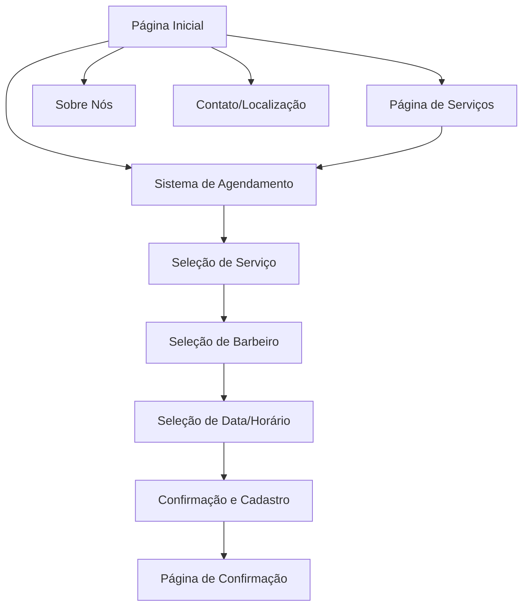

## 1. Visão Geral do Produto
Aplicação web para barbearia moderna que permite aos clientes visualizar serviços, conhecer a equipe e agendar horários online. O sistema visa facilitar o gerenciamento de agendamentos e melhorar a experiência do cliente através de uma interface intuitiva e responsiva.

O produto resolve o problema de agendamento manual em barbearias, permitindo que clientes marquem horários 24/7 e reduzindo a carga de trabalho da recepção. Ideal para barbearias que buscam modernizar seu atendimento e aumentar a eficiência operacional.

## 2. Funcionalidades Principais

### 2.1 Papéis de Usuário
| Papel | Método de Registro | Permissões Principais |
|------|---------------------|------------------|
| Cliente | Cadastro via formulário | Visualizar serviços, agendar horários, ver histórico |
| Administrador | Cadastro manual/convite | Gerenciar agendamentos, serviços, barbeiros e horários |

### 2.2 Módulos de Funcionalidades
Nossa aplicação de barbearia consiste nas seguintes páginas principais:

1. **Página Inicial**: Apresentação da barbearia, destaque dos principais serviços, call-to-action para agendamento.
2. **Página de Serviços**: Lista detalhada de todos os serviços oferecidos com descrições e preços.
3. **Página Sobre Nós**: Informações sobre a barbearia, história, equipe de barbeiros e ambiente.
4. **Página de Contato/Localização**: Informações de contato, endereço, horário de funcionamento e mapa de localização.
5. **Sistema de Agendamento**: Interface completa para marcação de horários com seleção de serviço, barbeiro, data e horário disponível.

### 2.3 Detalhes das Páginas
| Nome da Página | Módulo | Descrição da Funcionalidade |
|-----------|-------------|---------------------|
| Página Inicial | Hero Banner | Apresentar imagem principal da barbearia com mensagem de boas-vindas e botão para agendamento. |
| Página Inicial | Seção de Serviços | Exibir cards dos principais serviços com ícones visuais e links para página completa. |
| Página Inicial | Seção Sobre | Breve descrição da barbearia com link para página completa. |
| Página Inicial | Seção de Contato | Informações rápidas de contato e botão para WhatsApp. |
| Página de Serviços | Lista de Serviços | Apresentar todos os serviços em cards organizados por categoria (corte, barba, combo, etc.). |
| Página de Serviços | Detalhes do Serviço | Cada card deve mostrar nome, descrição, tempo estimado e preço. |
| Página de Serviços | Filtros | Permitir filtrar serviços por categoria e preço. |
| Sobre Nós | História | Texto narrativo sobre a fundação e valores da barbearia. |
| Sobre Nós | Equipe | Cards com foto, nome e especialidade de cada barbeiro. |
| Sobre Nós | Galeria | Carousel de imagens do ambiente da barbearia. |
| Contato/Localização | Informações de Contato | Telefone, email, endereço completo e horários de funcionamento. |
| Contato/Localização | Mapa | Integração com Google Maps mostrando a localização. |
| Contato/Localização | Formulário de Contato | Campos para nome, email, telefone e mensagem com validação. |
| Sistema de Agendamento | Seleção de Serviço | Interface para escolher um ou mais serviços desejados. |
| Sistema de Agendamento | Seleção de Barbeiro | Mostrar barbeiros disponíveis com foto e nome. |
| Sistema de Agendamento | Calendário de Disponibilidade | Calendário interativo mostrando datas disponíveis. |
| Sistema de Agendamento | Seleção de Horário | Grade horária mostrando slots disponíveis do dia selecionado. |
| Sistema de Agendamento | Confirmação | Resumo do agendamento com dados do cliente e detalhes do serviço. |
| Sistema de Agendamento | Cadastro/Login | Formulário para novos clientes ou login para clientes existentes. |

## 3. Fluxo Principal do Processo
O usuário acessa a página inicial, visualiza os serviços oferecidos e pode iniciar o agendamento através do call-to-action principal. Após selecionar os serviços desejados, escolhe o barbeiro preferido, seleciona data e horário disponíveis. O sistema verifica a disponibilidade em tempo real e confirma o agendamento, enviando notificação por email ou WhatsApp.

## 4. Design da Interface do Usuário

### 4.1 Estilo de Design
- **Cores Primárias**: Preto (#000000) e dourado (#D4AF37) para transmitir elegância e sofisticação
- **Cores Secundárias**: Branco (#FFFFFF) e cinza escuro (#333333) para contraste e legibilidade
- **Estilo de Botões**: Botões retangulares com bordas levemente arredondadas, efeito hover com mudança de tonalidade
- **Tipografia**: Fonte sans-serif moderna (Inter ou Roboto), títulos em negrito, corpo do texto regular
- **Ícones**: Estilo outline minimalista, preferencialmente em preto ou dourado
- **Layout**: Baseado em cards com sombras sutis, navegação superior fixa

### 4.2 Visão Geral do Design das Páginas
| Nome da Página | Módulo | Elementos de UI |
|-----------|-------------|-------------|
| Página Inicial | Hero Banner | Imagem de fundo em alta resolução, overlay escuro semi-transparente, texto em branco centralizado, botão CTA dourado com hover effect. |
| Página Inicial | Cards de Serviços | Grid responsivo 3x1 desktop/1x1 mobile, cards com ícone, título, descrição breve e preço, borda dourada sutil. |
| Página de Serviços | Grid de Serviços | Layout em grid responsivo, cards com imagem do serviço, nome, descrição detalhada, tempo estimado e preço destacado. |
| Sobre Nós | Equipe | Cards horizontais com foto circular, nome em fonte destacada, especialidade em texto menor, fundo branco com sombra. |
| Contato/Localização | Formulário | Campos com bordas arredondadas, labels flutuantes, botão de submit dourado, validação em tempo real com ícones de feedback. |
| Sistema de Agendamento | Calendário | Calendário mensal visual com dias disponíveis em verde, indisponíveis em cinza, seleção destacada em dourado. |
| Sistema de Agendamento | Grade Horária | Botões de horário em grid 4x3, disponíveis em verde claro, selecionados em dourado, passados em cinza. |

### 4.3 Responsividade
A aplicação segue abordagem desktop-first com adaptação completa para mobile. O layout utiliza breakpoints em 768px (tablet) e 480px (mobile). Elementos de naveção transformam-se em menu hamburger, grids ajustam-se de multi-coluna para single-column, e formulários adaptam-se para melhor usabilidade em telas touch. Otimização específica para interação touch com botões maiores e espaçamento adequado.

### 4.4 Elementos de Interação
- Animações suaves de scroll e transição entre páginas
- Efeitos hover em cards e botões com duração de 0.3s
- Loading states durante carregamento de dados
- Validação visual em formulários com ícones de sucesso/erro
- Notificações toast para confirmações e mensagens de erro