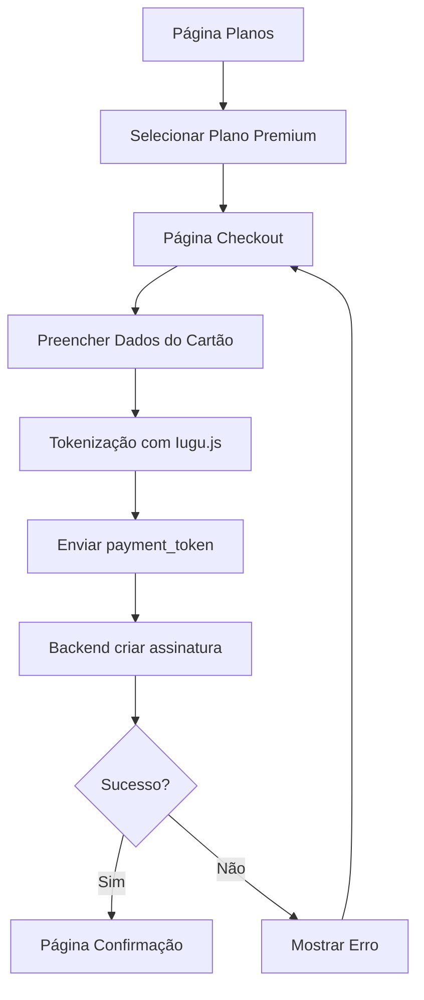

## 1. Visão Geral do Produto

Integração do checkout Iugu para permitir que barbeiros comprem assinaturas premium através de uma interface de pagamento segura, mantendo a identidade visual atual da barbearia.

**Problema:** Barbeiros precisam de um método simples e seguro para adquirir assinaturas premium diretamente na plataforma.
**Solução:** Integração com Iugu para processamento de pagamentos com tokenização de cartão e criação de assinaturas recorrentes.

## 2. Funcionalidades Principais

### 2.1 Papéis de Usuário

| Papel    | Método de Registro      | Permissões Principais                                      |
| -------- | ----------------------- | ---------------------------------------------------------- |
| Barbeiro | Cadastro via plataforma | Visualizar planos, realizar checkout, gerenciar assinatura |
| Admin    | Cadastro interno        | Gerenciar planos, visualizar vendas, configurar gateway    |

### 2.2 Módulos de Funcionalidades

O sistema de checkout Iugu consiste nos seguintes módulos principais:

1. **Página de Planos**: Exibição de planos disponíveis com beneficios
2. **Checkout de Pagamento**: Formulário seguro com tokenização de cartão
3. **Confirmação**: Página de sucesso com detalhes da assinatura

### 2.3 Detalhes das Páginas

| Nome da Página | Módulo                  | Descrição da Funcionalidade                                                                                            |
| -------------- | ----------------------- | ---------------------------------------------------------------------------------------------------------------------- |
| Planos         | Lista de Planos         | Exibir cards com planos free e premium, beneficios e preços. Botão "Assinar" para plano premium                        |
| Checkout       | Formulário de Pagamento | Campos para dados do cartão (número, nome, validade, CVV). Checkbox termos de serviço. Botão "Finalizar Assinatura"    |
| Checkout       | Resumo do Pedido        | Exibir plano selecionado, valor mensal, data de cobrança. Loading state durante processamento                          |
| Confirmação    | Mensagem de Sucesso     | Confirmar criação da assinatura, exibir ID da assinatura Iugu, próxima data de cobrança. Botão "Voltar para Dashboard" |

## 3. Fluxo Principal

### Fluxo de Compra do Barbeiro

1. Barbeiro acessa página de planos
2. Seleciona plano premium e clica em "Assinar"
3. Sistema redireciona para checkout com Iugu.js
4. Barbeiro preenche dados do cartão (tokenização no frontend)
5. Sistema envia payment\_token para backend
6. Backend cria cliente e assinatura no Iugu
7. Sistema confirma assinatura e redireciona para página de sucesso

## 4. Interface do Usuário

### 4.1 Estilo de Design

* **Cores primárias**: Manter paleta atual da barbearia (tons de dourado/preto)

* **Estilo de botões**: Arredondados com gradiente dourado

* **Fonte**: Inter ou sistema atual da plataforma

* **Layout**: Card-based com sombras suaves

* **Ícones**: Feather Icons ou pack atual

### 4.2 Visão Geral das Páginas

| Nome da Página | Módulo          | Elementos de UI                                                                                                |
| -------------- | --------------- | -------------------------------------------------------------------------------------------------------------- |
| Planos         | Cards de Planos | Cards horizontais com borda dourada para premium, badge "Mais Popular", lista de beneficios com checkmarks     |
| Checkout       | Formulário      | Inputs com bordas arredondadas, máscara de cartão em tempo real, ícones de segurança, badge "Pagamento Seguro" |
| Checkout       | Botão Principal | Botão grande com gradiente dourado, texto branco, loading spinner durante processamento                        |
| Confirmação    | Card de Sucesso | Ícone de check verde, mensagem de parabéns, detalhes da assinatura em cards separados                          |

### 4.3 Responsividade

* Desktop-first com adaptação mobile

* Formulário em coluna única em telas pequenas

* Cards de planos empilham verticalmente em mobile

* Touch-friendly com áreas de clique mínimas de 44px

## 5. Segurança e Conformidade

* Tokenização de cartão via Iugu.js (nunca armazenar dados de cartão)

* HTTPS obrigatório para todas as páginas de checkout

* Validação de campos em tempo real

* Rate limiting no endpoint de criação de assinatura

* Logs de auditoria para transações

