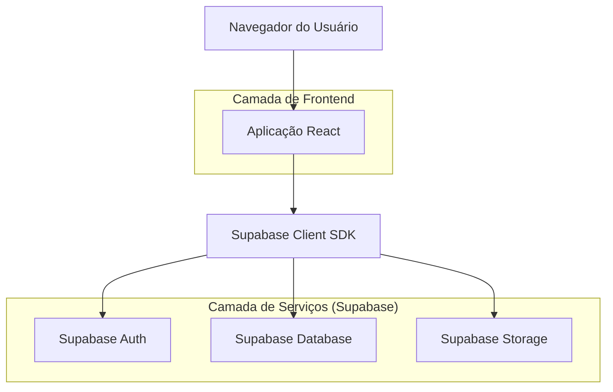
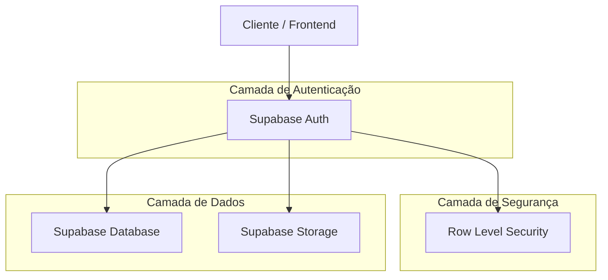
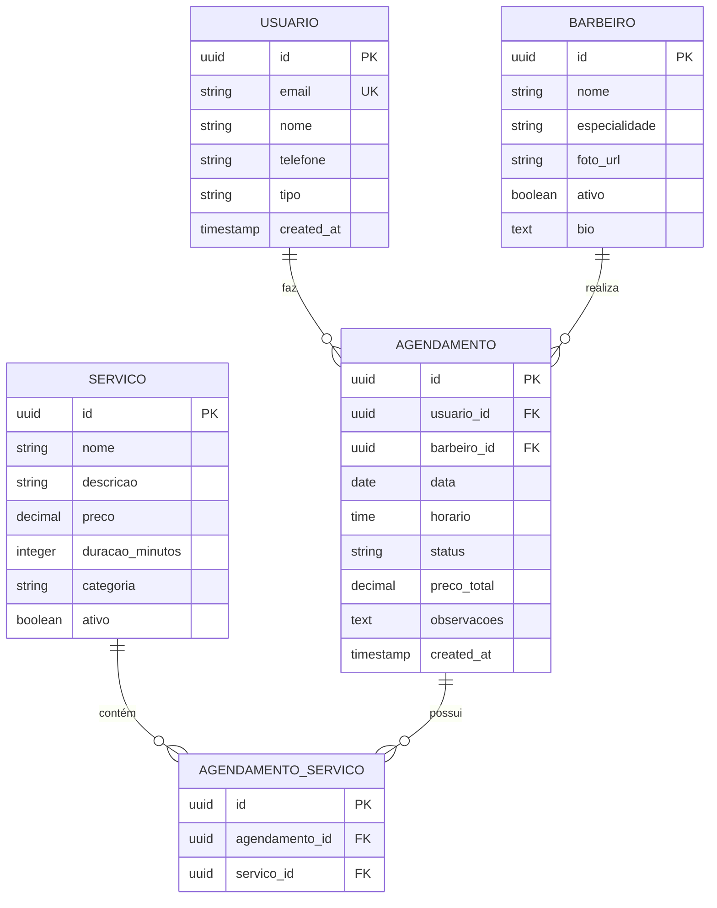

## 1. Arquitetura do Sistema



## 2. Descrição das Tecnologias
- Frontend: React@18 + Tailwind CSS@3 + Vite
- Ferramenta de Inicialização: vite-init
- Backend: Supabase (BaaS)
- Gerenciamento de Estado: React Context API
- Roteamento: React Router DOM@6
- Validação de Formulários: React Hook Form + Yup
- Notificações: React Hot Toast
- Componentes UI: Headless UI + Heroicons

## 3. Definições de Rotas
| Rota | Propósito |
|-------|---------|
| / | Página inicial com hero banner e destaques |
| /servicos | Lista completa de serviços oferecidos |
| /sobre | Informações sobre a barbearia e equipe |
| /contato | Formulário de contato e informações de localização |
| /agendamento | Fluxo completo de agendamento de horários |
| /login | Autenticação de usuários existentes |
| /cadastro | Registro de novos clientes |
| /perfil | Área do cliente com histórico de agendamentos |
| /admin/dashboard | Painel administrativo para gerenciar agendamentos |

## 4. Definições de API

### 4.1 Autenticação
```
POST /auth/v1/token
```

Request:
| Nome do Parâmetro | Tipo | Obrigatório | Descrição |
|-------------------|------|-------------|-----------|
| email | string | true | Email do usuário |
| password | string | true | Senha do usuário |
| type | string | true | Tipo de autenticação ('password') |

Response: Token JWT e dados do usuário

### 4.2 Agendamentos
```
GET /rest/v1/agendamentos
```

Parâmetros de Query:
| Nome | Tipo | Descrição |
|------|------|-----------|
| user_id | uuid | Filtrar por ID do usuário |
| data | date | Filtrar por data específica |
| barbeiro_id | uuid | Filtrar por barbeiro |
| status | string | Filtrar por status do agendamento |

### 4.3 Serviços
```
GET /rest/v1/servicos
```

Retorna lista de todos os serviços disponíveis com:
- ID do serviço
- Nome e descrição
- Preço e duração estimada
- Categoria do serviço

## 5. Arquitetura do Servidor



## 6. Modelo de Dados

### 6.1 Definição do Modelo de Dados


### 6.2 Linguagem de Definição de Dados

Tabela de Usuários (usuarios)
```sql
-- criar tabela
CREATE TABLE usuarios (
    id UUID PRIMARY KEY DEFAULT gen_random_uuid(),
    email VARCHAR(255) UNIQUE NOT NULL,
    nome VARCHAR(100) NOT NULL,
    telefone VARCHAR(20),
    tipo VARCHAR(20) DEFAULT 'cliente' CHECK (tipo IN ('cliente', 'admin')),
    created_at TIMESTAMP WITH TIME ZONE DEFAULT NOW()
);

-- criar índices
CREATE INDEX idx_usuarios_email ON usuarios(email);
CREATE INDEX idx_usuarios_tipo ON usuarios(tipo);
```

Tabela de Serviços (servicos)
```sql
-- criar tabela
CREATE TABLE servicos (
    id UUID PRIMARY KEY DEFAULT gen_random_uuid(),
    nome VARCHAR(100) NOT NULL,
    descricao TEXT,
    preco DECIMAL(10,2) NOT NULL,
    duracao_minutos INTEGER NOT NULL,
    categoria VARCHAR(50),
    ativo BOOLEAN DEFAULT true,
    created_at TIMESTAMP WITH TIME ZONE DEFAULT NOW()
);

-- criar índices
CREATE INDEX idx_servicos_categoria ON servicos(categoria);
CREATE INDEX idx_servicos_ativo ON servicos(ativo);
```

Tabela de Barbeiros (barbeiros)
```sql
-- criar tabela
CREATE TABLE barbeiros (
    id UUID PRIMARY KEY DEFAULT gen_random_uuid(),
    nome VARCHAR(100) NOT NULL,
    especialidade VARCHAR(100),
    foto_url TEXT,
    bio TEXT,
    ativo BOOLEAN DEFAULT true,
    created_at TIMESTAMP WITH TIME ZONE DEFAULT NOW()
);

-- criar índices
CREATE INDEX idx_barbeiros_ativo ON barbeiros(ativo);
```

Tabela de Agendamentos (agendamentos)
```sql
-- criar tabela
CREATE TABLE agendamentos (
    id UUID PRIMARY KEY DEFAULT gen_random_uuid(),
    usuario_id UUID REFERENCES usuarios(id),
    barbeiro_id UUID REFERENCES barbeiros(id),
    data DATE NOT NULL,
    horario TIME NOT NULL,
    status VARCHAR(20) DEFAULT 'pendente' CHECK (status IN ('pendente', 'confirmado', 'cancelado', 'concluido')),
    preco_total DECIMAL(10,2),
    observacoes TEXT,
    created_at TIMESTAMP WITH TIME ZONE DEFAULT NOW(),
    UNIQUE(data, horario, barbeiro_id)
);

-- criar índices
CREATE INDEX idx_agendamentos_usuario ON agendamentos(usuario_id);
CREATE INDEX idx_agendamentos_data ON agendamentos(data);
CREATE INDEX idx_agendamentos_status ON agendamentos(status);
```

Tabela de Relacionamento Agendamento-Serviço (agendamentos_servicos)
```sql
-- criar tabela
CREATE TABLE agendamentos_servicos (
    id UUID PRIMARY KEY DEFAULT gen_random_uuid(),
    agendamento_id UUID REFERENCES agendamentos(id) ON DELETE CASCADE,
    servico_id UUID REFERENCES servicos(id)
);

-- criar índices
CREATE INDEX idx_agendamentos_servicos_agendamento ON agendamentos_servicos(agendamento_id);
CREATE INDEX idx_agendamentos_servicos_servico ON agendamentos_servicos(servico_id);
```

### Configuração de Segurança (Row Level Security)
```sql
-- Permitir leitura pública de serviços e barbeiros
GRANT SELECT ON servicos TO anon;
GRANT SELECT ON barbeiros TO anon;

-- Permitir acesso completo aos usuários autenticados
GRANT ALL ON usuarios TO authenticated;
GRANT ALL ON agendamentos TO authenticated;
GRANT ALL ON agendamentos_servicos TO authenticated;

-- Políticas de segurança para agendamentos
CREATE POLICY "Usuários podem ver seus próprios agendamentos" ON agendamentos
    FOR SELECT USING (auth.uid() = usuario_id);

CREATE POLICY "Usuários podem criar agendamentos" ON agendamentos
    FOR INSERT WITH CHECK (auth.uid() = usuario_id);

CREATE POLICY "Usuários podem atualizar seus agendamentos" ON agendamentos
    FOR UPDATE USING (auth.uid() = usuario_id);
```